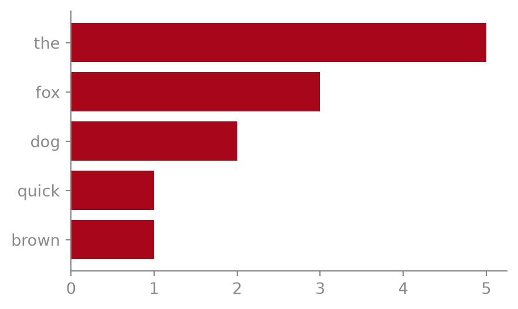

<span class="newthought">The Python and R demos</span> were written as
`.qmd` source files. This post skips that step entirely: it *is* a Jupyter
notebook (`.ipynb`), edited the normal way in Jupyter or JupyterLab, with a
raw cell at the top carrying the front matter instead of a `.qmd`’s YAML
header. Quarto renders `.ipynb` files exactly the same way it renders
`.qmd` files — same `hugo-md` output, same page bundle, same pipeline.

A quick word-frequency count, the kind of thing that’s easier to explore
interactively in a notebook than to write as a static script:

``` python
from collections import Counter

text = """
the quick brown fox jumps over the lazy dog
the dog barks at the fox but the fox is already gone
"""

words = text.split()
counts = Counter(words).most_common(5)
counts
```

    [('the', 5), ('fox', 3), ('dog', 2), ('quick', 1), ('brown', 1)]

And a plot of those counts, styled to match the other demo posts:

``` python
import matplotlib.pyplot as plt

labels, values = zip(*counts)
fig, ax = plt.subplots(figsize=(5, 3))
ax.barh(labels, values, color="#a8071a")
ax.invert_yaxis()
for spine in ("top", "right"):
    ax.spines[spine].set_visible(False)
plt.show()
```

<div class="quarto-figure">

</div>

Nothing here was hand-transcribed: the counts and the plot both come
from actually running the cells above at build time, whether the source
is a `.qmd` or, as here, a plain `.ipynb`.
