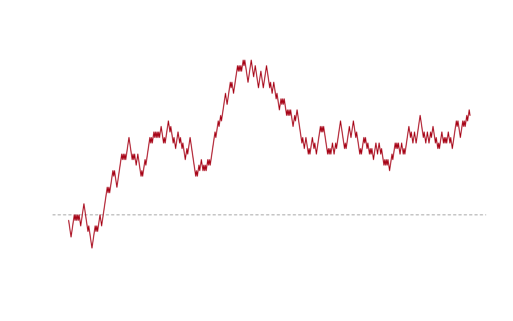

<span class="newthought">Quarto doesn’t care</span> which language produced
the numbers — the same `.qmd` → Hugo pipeline used in the [Python
demo](/posts/quarto-python-demo/) works for R too, executed through knitr
instead of Jupyter.  

A simple random walk, simulated and summarized:

``` r
set.seed(42)
steps <- sample(c(-1, 1), 500, replace = TRUE)
walk <- cumsum(steps)
summary(walk)
```

       Min. 1st Qu.  Median    Mean 3rd Qu.    Max.
      -6.00   11.00   13.00   13.18   16.00   28.00

``` r
plot(walk, type = "l", col = "#a8071a", lwd = 1.5,
     axes = FALSE, xlab = "", ylab = "",
     panel.first = abline(h = 0, col = "#888", lty = 2))
```

<div class="quarto-figure">

</div>

Data frames render as ordinary tables, the same way they would in any
other Quarto document:

``` r
knitr::kable(head(data.frame(step = seq_along(walk), position = walk), 5))
```

| step | position |
|-----:|---------:|
|    1 |       -1 |
|    2 |       -2 |
|    3 |       -3 |
|    4 |       -4 |
|    5 |       -3 |

The point, same as the Python post: this table and plot are computed by R
at build time, not maintained by hand.


